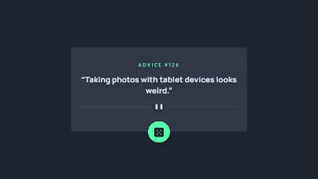

# Frontend Mentor - Advice generator app SOLUTION

## Welcome! 👋

Thanks for checking out my solution for this front-end coding challenge.

## Table of contents

- [Overview](#overview)
  - [The challenge](#the-challenge)
  - [Screenshot](#screenshot)
  - [Links](#links)
- [My process](#my-process)
  - [Built with](#built-with)
  - [What I learned](#what-i-learned)
  - [Continued development](#continued-development)
  - [Useful resources](#useful-resources)
- [Author](#author)
- [Acknowledgments](#acknowledgments)

## Overview

Users should be able to:

- View the optimal layout for the app depending on their device's screen size
- See hover states for all interactive elements on the page
- Generate a new piece of advice by clicking the dice icon

## Screenshot

## Links

- Live site deployed on Vercel: [Deploy](https://advice-generator-facundo.vercel.app/)

## Built with

- HTML5
- CSS
- Flexbox
- [React](https://reactjs.org/)
- [Next.js](https://nextjs.org/)
- [Tailwind CSS](thttps://tailwindcss.com/) - for styling

## What I learned

During the process of building the app I learned how to use Next.js and Tailwind which was a big challenge and I am proud of the results I had with them.

### Continued development

I will continue learning Next.js and Tailwind, particularly the animations for components and psedo classes uses.

### Useful resources

- [Tailwind CSS Docs](https://tailwindcss.com/docs/)
- [Next.js Docs](https://nextjs.org/docs)

## Author

- Github Profile - [https://github.com/facuperezm](https://github.com/facuperezm)
- FrontendMentor - [https://www.frontendmentor.io/facuperezm](https://www.frontendmentor.io/profile/facuperezm)
- Twitter - [https://twitter.com/FacuPerezM](https://twitter.com/FacuPerezM)
